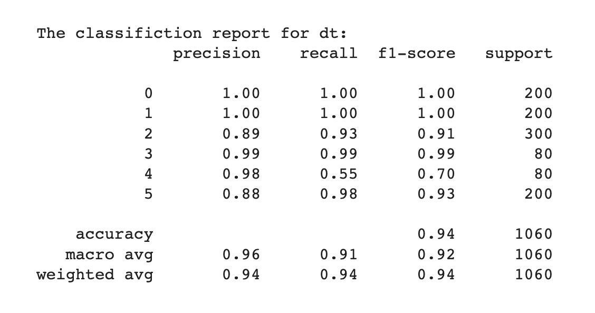

# Welcome to the algorithm group North Star!

## Team Arrangement
* **Wen Xueru**: Project Manager & Liaison & Tester

* **Dong Jin**: System Architect & Programmer

* **Zhou Changjiang**: Requirement Analyst & Programmer

## 3.30 Progress achieved

### Requirement Analysis 

- The server or potential platform user intend to pretrain the model for common people and further user-specified fine-tune process.
- The server or potential platform user wants  to change the model to make it the most suitable model for his or her.  
- The server or potential platform user  wants to predict the future mode of the user.
- The server or potential platform user intends to switch the scene to adapt to the requirements of specific scenarios.
- The server or potential platform user intends to select the algorithm to achieve the desired effect.

### rapid prototyping model

- **Classification**

  we use the **Decision Tree** algorithm to Implement the function of classification.

  

## 4.13 Progress achieved

### System design
[system design document](documents)
