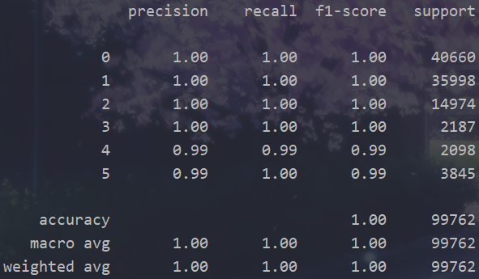

# Welcome to the algorithm group North Star!

## Team Arrangement
* **Wen Xueru**: Project Manager & Liaison & Tester

* **Dong Jin**: System Architect & Programmer

* **Zhou Changjiang**: Requirement Analyst & Programmer

## Hiring:

We welcome you to join our team if you are interested in **algorithms**.

We expect you to understand the basics of **machine learning** and to be able to use **Python** and the **Pytorch** framework.

### Contact: wenxr2119@mails.jlu.edu.cn
### Contact: 2577273670@qq.com

## 3.30 Progress achieved

### Requirement Analysis 

- The server or potential platform user intend to pretrain the model for common people and further user-specified fine-tune process.
- The server or potential platform user wants to change the model to make it the most suitable model for his or her.  
- The server or potential platform user wants to predict the future mode of the user.
- The server or potential platform user intends to switch the scene to adapt to the requirements of specific scenarios.
- The server or potential platform user intends to select the algorithm to achieve the desired effect.

### Rapid prototyping model

- **Classification**

  we use the **Decision Tree** algorithm to Implement the function of classification.

  

## 4.13 Progress achieved

### System Design

Here is the [system design documents](documents).

## 4.17 Progress achieved

### Rapid prototyping model

Macro-F1 reach 98.3% under the GRU network.

## 4.20 Progress achieved

### Tentative implement

Macro-F1 reach 98.0% with separated datasets.

Speed up the IO by transforming data format into csv.

## 4.26 Progress achieved

### Tentative implement of interface.

## 4.26 Progress achieved

### Rough implement of interface.

### Simple unitest.

### Solve the failure on the evaluation by set large window_size.

## 5.11 Progress achieved
Involved in integral test.
