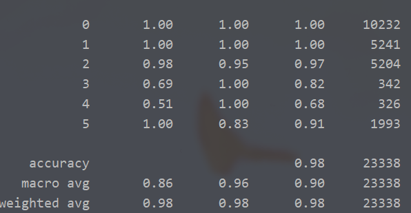

# Welcome to the algorithm group North Star!

## Team Arrangement

* **Wen Xueru**: Project Manager & Liaison & Tester

* **Dong Jin**: System Architect & Programmer

* **Zhou Changjiang**: Requirement Analyst & Programmer

## Hiring:

We welcome you to join our team if you are interested in **algorithms**.

We expect you to understand the basics of **machine learning** and to be able to use **Python** and the **Pytorch** framework.

### Contact: wenxr2119@mails.jlu.edu.cn

### Contact: 2577273670@qq.com

## 3.30 Progress achieved

### Requirement Analysis

- The server or potential platform user intend to pretrain the model for common people and further user-specified fine-tune process.
- The server or potential platform user wants to change the model to make it the most suitable model for his or her.
- The server or potential platform user wants to predict the future mode of the user.
- The server or potential platform user intends to switch the scene to adapt to the requirements of specific scenarios.
- The server or potential platform user intends to select the algorithm to achieve the desired effect.

### Rapid prototyping model

- **Classification**

  we use the **Decision Tree** algorithm to Implement the function of classification.

  

## 4.13 Progress achieved

### System Design

Here is the [system design documents](documents).

## 4.17 Progress achieved

### Rapid prototyping model

Macro-F1 reach 98.3% under the GRU network.

## 4.20 Progress achieved

### Tentative implement

Macro-F1 reach 98.0% with separated datasets.

Speed up the IO by transforming data format into csv.

## 4.26 Progress achieved

### Tentative implement of interface.

## 4.26 Progress achieved

### Rough implement of interface.

### Simple unitest.

### Solve the failure on the evaluation by set large window_size.

## 5.11 Progress achieved

### Involved in integral test.

## 5.18 Progress achieved

### Implementation for multiple algorithms, including **SVM** and **KNN**.

### Update the interface to the latest version.

### SVM

precision recall f1-score support

           0       1.00      1.00      1.00      5422
           1       1.00      1.00      1.00      5407
           2       0.78      0.98      0.87      5615
           3       0.92      1.00      0.96       489
           4       0.89      0.90      0.89       494
           5       0.00      0.00      0.00      1549

    accuracy                           0.91     18976

macro avg 0.76 0.81 0.79 18976
weighted avg 0.85 0.91 0.88 18976

### KNN

              precision    recall  f1-score   support

           0       1.00      1.00      1.00      5422
           1       0.82      1.00      0.90      5407
           2       1.00      0.24      0.39      5615
           3       0.16      0.93      0.27       489
           4       0.13      0.73      0.22       494
           5       0.00      0.00      0.00      1549

    accuracy                           0.69     18976

macro avg 0.52 0.65 0.46 18976
weighted avg 0.82 0.69 0.67 18976

### NaiveBayes

              precision    recall  f1-score   support

           0       1.00      1.00      1.00      5422
           1       1.00      0.98      0.99      5407
           2       0.94      0.92      0.93      5615
           3       0.76      1.00      0.86       489
           4       0.36      0.45      0.40       494
           5       1.00      0.97      0.98      1549

    accuracy                           0.95     18976

macro avg 0.84 0.89 0.86 18976
weighted avg 0.96 0.95 0.96 18976

### DecisionTree

              precision    recall  f1-score   support

           0       1.00      1.00      1.00      5422
           1       0.00      0.00      0.00      5407
           2       0.39      0.72      0.51      5615
           3       0.36      0.48      0.41       489
           4       0.23      0.96      0.37       494
           5       0.74      0.09      0.16      1549

    accuracy                           0.54     18976

macro avg 0.45 0.54 0.41 18976
weighted avg 0.48 0.54 0.47 18976