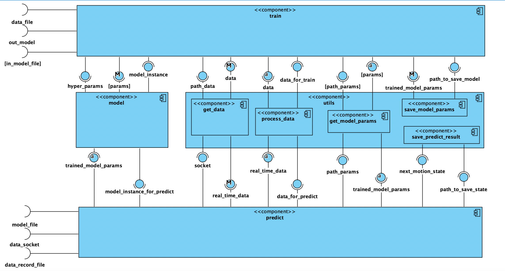

# Software Design Specification (SDS)

Revision History:

<!--
The server and client documents should be combined into one for a single project
-->

| Date   | Author      | Description            |
| ------ | ----------- | ---------------------- |
| Apr 7  | Xiaoquan XU | Converted the template |
| Apr 10 | DONG Jin    | the first version      |
|        |             |                        |
|        |             |                        |
|        |             |                        |
|        |             |                        |

## Introduction

### Intended Audience and Purpose

<!--
Every technical document should clearly specify who the document is written for and what purpose the document should serve for each intended audience. This section describes the purpose and audience for the Concept of Operations and the Software Requirements.
-->

### How to use the document

<!--
Describes the document organization. This section should answer for the reader: “Where do I find particular information about X?”
-->

## System Design

<!--
Use this section to give a detailed description of the system contexts from an architect's point of view. It should make clear the expected context of the software, such as the platform, design pattern, etc.
-->

### Context

<!--
Specifies the system's operational context: i.e., the programming languages to develop the software with, the operating system your software runs on, the database management system your data will be stored, the internet protocol for the component communication, etc.
-->

### Design Pattern

<!--
Specifies the technical details of the software system: i.e., model-view-control division, restful service pattern, etc.
-->

### Architecture

#### \<Component Diagram\>

<!--
Component Diagram (CD) specifies how the system is parted according to the use cases analyzed from RS. 
-->

## Module Interface Design

<!--
It specifies the contracts with which the modules communicate.
-->

<!--
Mogic for System Interface Specifications, extra template available; all groups should contribute via interface design of her own module.
-->

## Detailed Design

<!--
It specifies the design information inside the modules.
-->

<!--
Each group should contribute, via diagrams either for the whole system or for her module. Optional diagrams are ER diagram, Sequence diagram, Class diagram
-->

### Server Detailed Design

### Client (Android) Detailed Design

### Client (Web/Desktop) Detailed Design

## Appendices

### Definitions and acronyms

#### Definitions

| Keyword | Definitions |
| ------- | ----------- |
|         |             |
|         |             |
|         |             |

#### Acronyms and abbreviations

| Acronym or Abbreviation | Definitions |
| ----------------------- | ----------- |
|                         |             |
|                         |             |
|                         |             |

### References

https://online.visual-paradigm.com/tw/diagrams/tutorials

